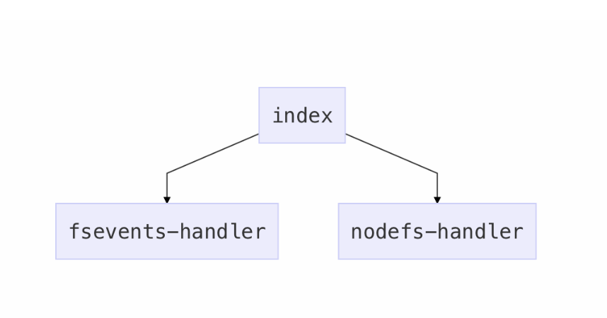

# chokidar 最小高效的文件监听库

为什么 nodejs 有了 `fs.watch()`、`fs.watchFile()`，chokidar 还需要进行封装

chokidar 的解释

## nodejs 的 fs.watch() 的问题

1. 不报告 macos 上的文件名
2. 在 macos 上使用 Sublime 编辑器时，不报告事件
3. 经常调用事件两次
4. 以重命名的方式报告改变
5. 不提供递归查看文件树的简单方式
6. 在 Linux 上不提供递归监听

## nodejs 的 fs.watchFile() 的问题

1. 在事件处理上同样糟糕
2. 同样不提供递归监听
3. 导致过高的 CPU 使用率

而 chokidar 解决了上述问题

## chokidar 目录结构



1. index 为入口文件，如果是 Macos 平台，则使用 `fsevents-handler` ，其他平台使用 `nodefs-handler`
2. `nodejs-handler` 基于 nodejs 的 `fs.watch()`、`fs.watchFile()` 实现对文件的监听
3. `fsevents-handler` 自制的文件资源监听，没有使用 nodejs 的 fs 接口

```js
const watch = (paths, options) => {
  const watchs = new FSWatcher(options);
  watchs.add(paths);
  return watchs;
};
export.watch = watch;
```

```js
class FSWatcher extends EventEmitter {
  constructor(_opts) {
    super();
    // 判断是使用 nodejs-handler 还是 fsevents-handler
    if (opts.useFsEvents) {
      this._fsEventsHandler = new FsEventsHandler(this);
    } else {
      this._nodeFsHandler = new NodeFsHandler(this);
    }
  }
  /**
   * 根据当前环境选择对应的 监听方式 监听路径 fsEvents-handler/nodejs-handler
   * paths_ 需要监听的文件路径
   * _origAdd 用于处理不存在的路径监听
   * _internal 表示非用户添加
   */
  add(paths_, _origAdd, _internal) {
    const { cwd, disableGlobbing } = this.options;
    this.closed = false;
    let paths = unifyPaths(paths_);
    if (cwd) {
      paths = paths.map(path => {
        // 获取绝对路径
        const absPath = getAbsolutePath(path, cwd);
        // 标准化路径
        return normalizePath(absPath);
      });
    }
    paths = paths.filter(path => {
      // 过滤 glob
      if (path.startsWith('!')) {
        this._ignoredPaths.add(path.slice(1));
        return false;
      }
      return true;
    });
    // 判断使用 fsEventsHandler 还是 nodeFsHandler
    if (useFsEvents && this._fsEventsHandler) {
      // 使用 fsevents 处理路径
      paths.forEach(path => this._fsEventsHandler._addToFsEvents(path));
    } else {
      // 使用 Promise.all() 处理 paths 后
      Promise.all(async path => {
        let res = this._nodeFsHandler._addToNodeFs(path, !_internal, 0, 0, _origAdd);
        if (res) this._emitReady();
        return res;
      }).then(result => {
        if (this.closed) return;
        // 递归处理 路径
        result
          .filter(item => item)
          .forEach(item => {
            this.add(sysPath.dirname(item), sysPath.basename(_origAdd || item));
          });
      });
    }
    return this;
  }
}
```
