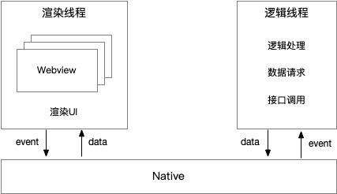

# 微信小程序双线程模型

## 微信小程序的主要技术需求

- 限制 UI 组件类型，只允许指定的几种组件
- 保证逻辑线程安全，不允许直接操作 DOM
- 能够在线更新，不依赖微信
- 性能要好，保证用户体验

## 为什么微信小程序使用双线程模型

> 小程序的架构设计时，要求渲染快、加载快。渲染页面的技术主要分三种

- 1.纯客户端原生技术渲染（纯客户端技术需要与微信代码一起打包，跟随微信发布版本，这样无法做到小程序在线发布）
- 2.纯 web 技术渲染（纯 web 技术，一些复杂交互页面可能面临一些性能问题。因为在 web 技术中，UI 和 JS 的脚步在单线程中，容易导致逻辑任务抢占 UI 渲染资源）
- 3.介于客户端和 web 技术之间（Hybrid 技术`混合开发技术`）

## 微信小程序如何使用双线程

> 微信小程序分为`渲染层`/`逻辑层`分别由`两个线程`来管理

- `渲染层`: 界面渲染相关的任务全都在 webview(`webview 是一个完整的类浏览器运行环境`) 里执行。一个小程序存在多个界面，所以渲染层存在多个 webview 线程
- `逻辑层`: 使用客户端提供的 JavaScript 引擎运行代码 `ios 的JavaScriptCore`、`安卓的 JsCore`、`IDE 的 nwjs`

> 逻辑线程是一个只能运行 JavaScript 的沙箱环境，不提供 DOM 操作相关 API，所以只能通过 setData 更新数据的方式异步更新 UI

## 小程序的通信方式

> 事件驱动的通信方式

- 用户在页面中(`渲染层`)触发交互事件 event
- 然后 event 被传递给逻辑层
- 逻辑层通过一系列的逻辑处理、数据请求、接口调用等行为将加工好的数据传递给渲染层
- 最后渲染层将 data 渲染层可视的 UI

## 引发渲染性能问题的一些原因

- setData 传递大量的新数据

  > 数据的传输会经历跨线程传输和脚本编译的过程，当数据量过大，会增加脚本编译的执行时间，占用`webview JS` 线程

- 频繁的 setData 操作

  > 频繁的执行 setData 会让`webview JS`线程一直忙碌于脚本的编译、节点数的对比计算和页面渲染。导致

  1. 页面渲染延时
  2. 用户交互延时

- 过多的页面节点数

  > 过多的节点数，导致节点计算和页面渲染的耗时增长

## 渲染性能优化

- 减少 setData 数据传输量
- 降低 setData 调用频率

## 参考

- [理解微信小程序的双线程模型](https://cloud.tencent.com/developer/article/1826156)
- [微信小程序的双线程模型](https://qunarcorp.github.io/anu/documents/two-threaded.html)
